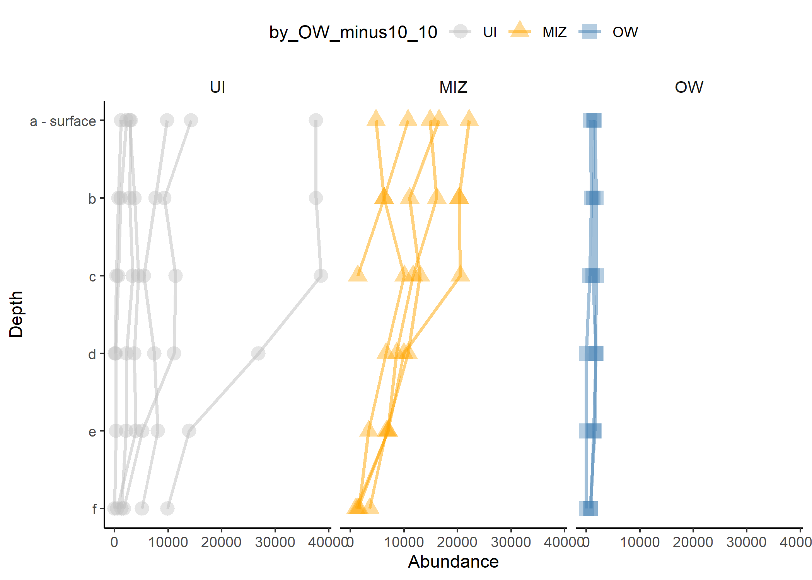
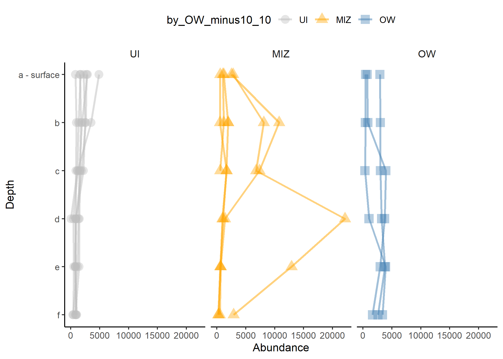
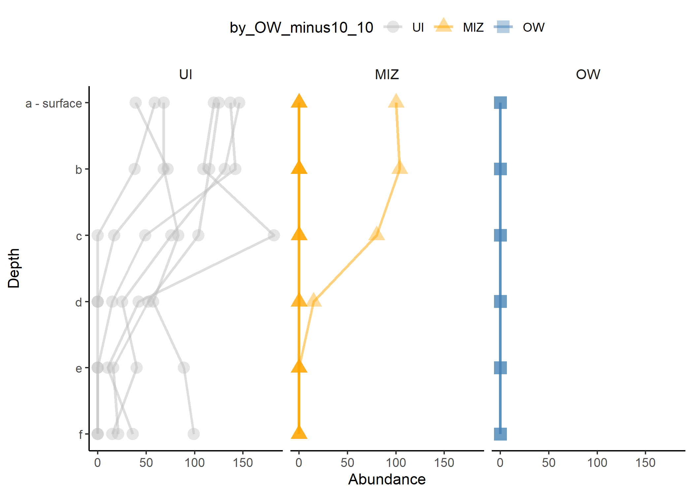

```{r, echo=FALSE, eval=FALSE}

rmarkdown::render('GE_AM_phyloseq.Rmd', output_file = 'GE_AM_phyloseq.html')
```

```{r knitr_init, echo=FALSE, cache=FALSE, warning=FALSE}

library(knitr)
library(rmdformats)

## Global options
options(max.print="75")
opts_chunk$set(echo=TRUE,
	             cache=FALSE,
               prompt=FALSE,
               tidy=TRUE,
               comment=NA,
               message=FALSE,
               warning=FALSE,
               fig.height=6, 
               fig.width=8)
opts_knit$set(width=75)
```

# Presentation

> Procotol used to generate data for the paper "Arctic phytoplankton microdiversity across the marginal ice zone suggests sub-species vulnerability to sea-ice loss".

Authors:Catherine Gérikas Ribeiro, Daniel Vaulot, Dominique Marie, Nicole Trefault, Connie Lovejoy, and Adriana Lopes dos Santos.


# Load libraries

```{r, warning=FALSE, message=FALSE}

library("ggplot2")
library("dplyr")
library("tidyr")
library("tibble")
library("plotrix") # standard error
library("readxl") # read excel file
library("readr") 
library("lubridate") 
library("stringr")
library("phyloseq")
library("corrplot")
library("ape")
library("patchwork") # compose images
library("cowplot")
library("ComplexUpset")
library("vegan")
library("indicspecies")
library("glue")
library("ggtext")
library("ggpubr") #add p-values
library("expss")
library("ggrepel")
library(devtools)
install_github("vqv/ggbiplot")
library("ggbiplot")
library("ggfortify")
 options(stringsAsFactors = FALSE)
 library("reshape2")
```

# Read color pallete

```{r define_colors}

# class
class_excluded <- c("Bangiophyceae", "Florideophyceae", "Xanthophyceae", "Phaeophyceae") 
class_colors <- read_excel("colors.xlsx", sheet = "classes") %>% filter(!(class %in% class_excluded))
class_colors <-structure(class_colors$color_name,.Names=class_colors$class) 
 
# genus
genus_colors <- read_excel("colors.xlsx", sheet = "genus")
genus_colors <- structure(genus_colors$color_name,.Names=genus_colors$genus) 
 
# division
division_colors <- read_excel("colors.xlsx", sheet = "divisions")
division_colors <-structure(division_colors$color_name,.Names=division_colors$division) 
 
```

# Sampling stations

![Figure 1. Location of the sampling stations in Baffin Bay and environmental variables at surface. (A) Sampling stations indicating the sea-ice concentration (%), the red arrow represents the warmer West Greenland Current (WGC) and the blue arrow represents the Pacific-originated Baffin Current (BI); (B) Temperature (◦C) at surface; (C) Depth of the nitracline at each station (meters); (D) Open Water Days: amount of days of open water before (positive values) or after (negative values) the sampling day of each station; (E) Nitrate concentration on the surface sample (µM). A dashed line separates sampling stations with more (east) and less (west) than 80% sea-ice cover.](./IMAGES/figure_map.png)

# Sampling station clustering

> In the present work, sampling stations were clustered into "Open Water" (OW), "Marginal Ice Zone" (MIZ) and "Under Ice" (UI) on the basis of its sea ice cover temporal dynamics. The parameter used was "Open Water Days" (OWD), representing how many days a giving station had been ice-free before sampling (positive values) or how many days it took for it to become ice-free after sampling (negative values) (see Randelhoff et al. 2019). Stations with OWD \> 10 days of open water before sampling day were considered OW, station with 10 to -10 days were considered within the MIZ, and stations with OWD \< -10 days were considered UI (Table 1). The OWD was reported to be well correlated to distance from the ice edge (Randelhoff et al. 2019).

# Build a phyloseq object from Excel tables

## Importing excel table

```{r importing_table}

  OTU_tb <- read.table(as.matrix("OTU_table.txt"), row.names=1)
  TAX_tb <- read.table("TAX_table.txt")
  SAMPLE_tb <- read.table("SAMPLE_DATA_table2.csv", header = TRUE, sep = ";", quote = "\"", dec = ",", fill = TRUE, comment.char = "", row.names=1)

```

## Convert raw data to phyloseq components

```{r convert_objects}

  otu1 <- otu_table(as.matrix(OTU_tb), taxa_are_rows=FALSE)
  sam1 <- sample_data(SAMPLE_tb, errorIfNULL = T) 
  tax1 <- tax_table(as.matrix(TAX_tb))

```

## Create adjusted phyloseq object

```{r create_phyloseq}

  physeq <- phyloseq(otu1, tax1, sam1)

```

# Data transformation and filtering

## Remove samples with less than reads_min

```{r remove_reads_min}

  reads_min <- 3000  
  physeq_readsmin <- prune_samples(sample_sums(physeq) > reads_min, physeq)
  physeq_readsmin
  
```

## Normalize by median

```{r normalize_median}

  total <- median(sample_sums(physeq_readsmin))
  str_c("Median number of reads: ",total)
  standf <- function(x, t=total) round(t * (x / sum(x)))
  physeq_readsmin_normal <- transform_sample_counts(physeq_readsmin, standf)
  physeq_readsmin_normal
  
```

## Remove Metazoa

```{r remove_metazoa}

  physeq_readsmin_nonMetazoa <- subset_taxa(physeq_readsmin_normal, division != "Metazoa")

```

## Filter Dinoflagellata reads 

```{r filter_dinos}

  physeq_nonDino <- subset_taxa(physeq_readsmin_nonMetazoa, division != "Dinoflagellata")
  physeq_Dino <- subset_taxa(physeq_readsmin_nonMetazoa, division == "Dinoflagellata")
  
```

## Extract photosynthetic taxa

```{r extract_photo}

physeq_photo3 <- subset_taxa(physeq_nonDino, 
                             (division %in% c("Chlorophyta", "Cryptophyta", "Haptophyta", "Ochrophyta", "Cercozoa")) 
                             & !(class %in% c("Syndiniales", "Sarcomonadea", "Filosa-Thecofilosea", "Filosa-Imbricatea", "Filosa-Granofilosea", "Chlorarachniophyceae")) & !genus == "Spumella"
                             )

```


## Divide regarding size fraction

```{r size_fractions}

  physeq_0_2um_b <- subset_samples(physeq_photo3, size_fraction %in% ("0-2um"))
  physeq_3um_b <- subset_samples(physeq_photo3, size_fraction %in% ("3um"))
  physeq_20um_b <- subset_samples(physeq_photo3, size_fraction %in% ("20um"))

```


## Abundant taxa

Select taxa comprising the 90% most abundant ASVs in at least 1 sample on each size fraction. For selection disregarding size fraction it was used 1/10 of the samples to include less taxa.

```{r abundant_taxa}

  f1_b <- filterfun_sample(topf(0.9)) 

  wh02 <- genefilter_sample(physeq_0_2um_b, f1_b, A=1) #function must be true for at least one sample (A) 
  physeq_0_2um_b_abund <- prune_taxa(wh02, physeq_0_2um_b)

  wh3 <- genefilter_sample(physeq_3um_b, f1_b, A=1) 
  physeq_3um_b_abund <- prune_taxa(wh3, physeq_3um_b)

  wh20 <- genefilter_sample(physeq_20um_b, f1_b, A=1) 
  physeq_20um_b_abund <- prune_taxa(wh20, physeq_20um_b)

  nsamples_whall <- (1/10*nsamples(physeq_photo3))
  whall <- genefilter_sample(physeq_photo3, f1_b, A=nsamples_whall) 
  physeq_photo3_abund <- prune_taxa(whall, physeq_photo3)

# Another function for upset images

  f1_c <- filterfun_sample(topf(0.7)) #creates a function to keep 70% most sequences
  whall_up <- genefilter_sample(physeq_photo3, f1_c, A=1) 
  physeq_photo3_abund_upset <- prune_taxa(whall_up, physeq_photo3)

```


## Compile data by taxa ranks with tax_glom

```{r tax_glom}

  TG_division <- tax_glom(physeq_photo3_abund, "division")
  TG_class <- tax_glom(physeq_photo3_abund, "class")
  TG_genus <- tax_glom(physeq_photo3_abund, "genus")

```

## Melt phyloseq objects into single table with psmelt function

```{r melt_phyloseq}

  melt_physeq_photo3 <- psmelt(physeq_photo3) 
  melt_physeq_photo3_abund <- psmelt(physeq_photo3_abund)
  melt_physeq_photo3_abund_upset <- psmelt(physeq_photo3_abund_upset)
  melt_TG_division <- psmelt(TG_division)
  melt_TG_class <- psmelt(TG_class)
  melt_TG_genus <- psmelt(TG_genus)

```


## Order factor variables

Only worked with melted objects

```{r order_variables}

# order sectors
melt_TG_division$by_OW_minus10_10 <- factor(melt_TG_division$by_OW_minus10_10, levels = c("UI", "MIZ", "OW"))
melt_TG_class$by_OW_minus10_10 <- factor(melt_TG_class$by_OW_minus10_10, levels = c("UI", "MIZ", "OW"))
melt_TG_genus$by_OW_minus10_10 <- factor(melt_TG_genus$by_OW_minus10_10, levels = c("UI", "MIZ", "OW"))

# order by size fraction (fraction_name)
melt_TG_division$fraction_name <- factor(melt_TG_division$fraction_name, levels = c("0.2-3 um", "3-20 um", "> 20 um"))
melt_TG_class$fraction_name <- factor(melt_TG_class$fraction_name, levels = c("0.2-3 um", "3-20 um", "> 20 um"))
melt_TG_genus$fraction_name <- factor(melt_TG_genus$fraction_name, levels = c("0.2-3 um", "3-20 um", "> 20 um"))

# order genus by division
melt_TG_genus <- melt_TG_genus %>%
  arrange(division, class) %>%
  mutate(genus = factor(genus, unique(genus)))
```

# Bar plots

## Depth x Abundance (Division)

```{r, fig.height=5, fig.width=7, barplot_division}

bar_division <- ggplot(melt_TG_division, aes(x = depth_rank, y = Abundance, fill = division)) +
    geom_bar(stat = "identity", position = "fill") +
    theme_classic() +
    xlab("Depth") + 
    ylab("Abundance") + 
    coord_flip() + 
    facet_grid(fraction_name~by_OW_minus10_10) + 
    theme(legend.position="top",  strip.background = element_rect(fill = "white", color = "white"), strip.text = element_text(size = 10)) + 
    scale_fill_manual(values = division_colors) +
    scale_x_reverse(breaks = c(1, 2, 3, 4, 5, 6), label= c("a - surface", "b", "c", "d", "e", "f")) +
    scale_y_continuous(labels = function(x) paste0(x*100, "%")) # Multiply by 100 & add %  

bar_division

```

## Depth x Abundance (Genus)

```{r, fig.height=8, fig.width=9, barplot_genus}

bar_genus <- ggplot(melt_TG_genus, aes(x = depth_rank, y = Abundance, fill = genus)) +
    geom_bar(stat = "identity", position = "fill", alpha=.9) +
    theme_classic() +
    xlab("Depth") + 
    ylab("Abundance") + 
    coord_flip() + 
    facet_grid(fraction_name~by_OW_minus10_10) + 
    theme(legend.position="top",  strip.background = element_rect(fill = "white", color = "white"), strip.text = element_text(size = 10)) + 
    scale_fill_manual(values = genus_colors) +
    scale_x_reverse(breaks = c(1, 2, 3, 4, 5, 6), label= c("a - surface", "b", "c", "d", "e", "f")) +
    scale_y_continuous(labels = function(x) paste0(x*100, "%")) # Multiply by 100 & add %  

bar_genus

```

# Data management

Creating a single table with added abundances by taxa ranks

## Subset melted physeq

```{r subset_genus}

genus_abund_table <- subset(melt_physeq_photo3_abund, 
                     select = c("OTU", 
                                "Sample", 
                                "Abundance", 
                                "genus"))

```

## Sum of reads abundance by GENUS

```{r sum_genus, echo=FALSE, cache=FALSE, warning=FALSE}

# extract dimensions info from the initial matrix, select the last vertical element
dimension_table <- dim(genus_abund_table)
dimension_table <- dimension_table[1]

# extract unique values from samples and divisions by column
unique_samples <- unique(genus_abund_table[,2])
unique_taxa <- unique(genus_abund_table[,4])

# create a temporary empty matrix with the final dimensions
matrix_temp <- matrix(0, length(unique_samples), length(unique_taxa))

# iterate line by line through the initial matrix

for (i in 1:dimension_table)
  
{
  temp <- genus_abund_table[i,]
  
#get x and y coordinates
  x <- match(temp[2], unique_samples)
  y <- match(temp[4], unique_taxa)

  
# add abundance values from initial matrix and store at position x and y
  matrix_temp[x, y] <- matrix_temp[x, y] + temp[,3]
 
} 
 
# create a data frame to restore abundance matrix column and row names
genus_temp_df <- as.data.frame(matrix_temp, row.names = unique_samples)
colnames(genus_temp_df) <- unique_taxa
genus_temp_df

# merge tables
genus_temp_df <- genus_temp_df %>% rownames_to_column("samples")
SAMPLE_tb_df <- SAMPLE_tb %>% rownames_to_column("samples")
merged_genus_df <- merge(genus_temp_df, SAMPLE_tb_df, by.x = "samples", by.y = "samples")
merged_genus_df

# order factors 
SAMPLE_tb_df$by_OW_minus10_10 <- factor(SAMPLE_tb_df$by_OW_minus10_10, levels = c("UI", "MIZ", "OW"))
```

# FCM plots


```{r, fig.height=4, fig.width=6, flow_cytometry2}

SD_20um <- SAMPLE_tb_df %>% 
  filter(size_fraction == "20um") #select just one set of the environmental data

flow_name <- c("pico_ml", "nano_ml", "crypto_ml")

for (i in flow_name) {

ggplot(SD_20um, aes(x=depth_rank, y= SD_20um[,i], group=station_id, color=by_OW_minus10_10, shape = by_OW_minus10_10)) +
  geom_line(size=1, alpha = 0.5) +
  coord_flip() +
  scale_x_reverse(breaks = c(1, 2, 3, 4, 5, 6), label= c("a - surface", "b", "c", "d", "e", "f")) +
  xlab("Depth") + 
    ylab("Abundance") +
  theme_classic() +
  theme(legend.position="top",  strip.background = element_rect(fill = "white", color = "white"), strip.text = element_text(size = 10)) +
   scale_colour_manual(values = c("gray", "orange", "steelblue","white")) +
  geom_point(size = 4, alpha = 0.4) +
  facet_wrap("by_OW_minus10_10")  
 
}


```








# Upset plots

Phyloseq & ComplexUpset

Modified from <https://tips.cgrb.oregonstate.edu/posts/phyloseq-bug-meeting-presentation-fall-2019/>

and

<https://krassowski.github.io/complex-upset/articles/Examples_R.html#1-adding-components>

## Create intersection table for UpSet graphics

```{r upset_plots}

# create upset funtion
upset_df_maker_function <- function(df_physeq) {
  
# get binary values
ps.merge_by_variable <- merge_samples(df_physeq, "by_OW_minus10_10", fun = sum)
upset_obj_otu_table <- as.data.frame(t(otu_table(ps.merge_by_variable)))
upset_obj_binary <- sapply(upset_obj_otu_table, function(x) ifelse(x > 0, 1, 0),
                          USE.NAMES = T)
rownames(upset_obj_binary) <- rownames(upset_obj_otu_table)
upset_obj_binary <- as.data.frame(upset_obj_binary)

# extract tax_table
upset_tax_table = as(tax_table(df_physeq), "matrix")
if(taxa_are_rows(df_physeq)){
  upset_tax_table <- t(upset_tax_table)
  }
upset_tax_table_df = as.data.frame(upset_tax_table)

# add col names
upset_obj_binary_colname <- upset_obj_binary %>% rownames_to_column("OTU")
upset_tax_table_df_colname <- upset_tax_table_df %>% rownames_to_column("OTU")
upset_obj_otu_table_colname <- upset_obj_otu_table %>% rownames_to_column("OTU") #add abundance

# merge files
upset_obj_binary <- merge(upset_obj_binary_colname, upset_tax_table_df_colname, by.x = "OTU", by.y = "OTU")
upset_obj_binary = as.data.frame(upset_obj_binary)
upset_obj_binary = na.omit(upset_obj_binary)

upset_MERGED <- merge(upset_obj_binary, upset_obj_otu_table_colname, by.x = "OTU", by.y = "OTU", suffixes = c("", "_abund"))

# create extra column with the sum of read abundance/OTU
colnms=c("MIZ_abund", "OW_abund", "UI_abund")
upset_MERGED$Abundance <- rowSums(upset_MERGED[,colnms])

return(upset_MERGED)

}

# create set

upset_MERGED_ALL_upset <- upset_df_maker_function(physeq_photo3_abund_upset)
upset_MERGED_ALL <- upset_df_maker_function(physeq_photo3)


```

## UpSet at class level


## Upset class level labeling ASVs/species

```{r, fig.height=15, fig.width=15, upset_class}

  set.seed(42)

  upset_figure_function <- function(upset_intersection_table) {
  
# create sets
  sections = colnames(upset_intersection_table)[2:4]

# create sections table
  upset_intersection_table[sections] = upset_intersection_table[sections] == 1
  t(head(upset_intersection_table[sections], 3))

# order genus by class and division
  upset_intersection_table <- upset_intersection_table %>%
  arrange(division, class) %>%
  mutate(genus = factor(genus, unique(genus)))

  upset(upset_intersection_table,
  sections, 
  height_ratio=0.4,
  
  matrix=(intersection_matrix(geom=geom_point(size=2))),
  
  base_annotations=list(
    'Shared ASVs'=intersection_size(
      mapping=aes(fill=class), counts = FALSE, text_colors = c(on_background="gray40", on_bar="gray40"), text = list(size=3, vjust=-0.7))
          + scale_fill_manual(values = class_colors) 

    ),
  
  annotations = list('Read abundance (log10)'=(
      ggplot(mapping=aes(y=log10(Abundance)))
      + geom_jitter(aes(color=class), size=7, na.rm=TRUE, show.legend = FALSE, width = 0.2)
     # + geom_label_repel(aes(label= OTU), hjust=0, vjust=0, box.padding = 0.1, max.overlaps = 30, seed = 1)
      + scale_color_manual(values = class_colors) 
      + geom_violin(alpha=0.3, na.rm=TRUE))),
 
  width_ratio=0.2,
  
  themes=upset_default_themes(text=element_text(size = 25)))
  
  }


 upsALL <- upset_figure_function(upset_MERGED_ALL_upset)
 ggsave("./IMAGES/figure_upset_abundant_photo.png", height = 15, width = 15)
 upsALL

```

# Number of ASVs per genus


## Subset merged table

```{r subset_Nasvs}

ASVs_presence_table <- subset(upset_MERGED_ALL, 
                     select = c("OTU", 
                                "MIZ", 
                                "OW", 
                                "UI",
                                "genus"))

```

## Count number of ASVs

```{r count_asvs}

# extract dimensions info from the initial matrix, select the last vertical element

dimension_table <- dim(ASVs_presence_table)
dimension_table <- dimension_table[1]

# extract unique genera
unique_genus <- unique(ASVs_presence_table[,5])

# create a temporary empty matrix with the final dimensions
matrix_temp <- matrix(0, length(unique_genus), 4)
colnames(matrix_temp) <- c("MIZ", "OW", "UI", "total")
matrix_temp <- cbind(matrix_temp, genus = unique_genus)
matrix_df <- as.data.frame(matrix_temp)
#iterate line by line through the initial matrix

for (i in 1:dimension_table)
  
{
  temp <- ASVs_presence_table[i,]
  
#get x and y coordinates
  
x <- match(temp[5], matrix_df[, 5])
   
matrix_df[x, 1] <- as.numeric(matrix_df[x, 1]) + temp[1,2]
matrix_df[x, 2] <- as.numeric(matrix_df[x, 2]) + temp[1,3]
matrix_df[x, 3] <- as.numeric(matrix_df[x, 3]) + temp[1,4]
matrix_df[x, 4] <- as.numeric(matrix_df[x, 4]) + 1

} 
 
```

## Bubble plot

```{r, fig.height=4, fig.width=3, bubble_asvs}

matrix_df2 <-  subset(matrix_df, total > 2)


matrix_df_xm <- melt(matrix_df2, id.vars = "genus", variable.name = "Sectors", value.name = "Size")
str(matrix_df_xm)

matrix_df_xm <- transform(matrix_df_xm, Size = as.numeric(Size))

matrix_df_xm$Sectors <- factor(matrix_df_xm$Sectors, levels = c("UI", "MIZ", "OW", "total"))


bubble_asv <- ggplot(matrix_df_xm, aes(x = Sectors, y = genus)) +
  scale_colour_manual(values = c("gray", "orange", "steelblue","white"))  +
  geom_point(aes(colour = Sectors, size = Size), alpha = 0.4) +
  geom_label(label=matrix_df_xm$Size, alpha = 0.1, size = 2,label.size = 0) +
  theme_classic() +
  theme(axis.text.y = element_text(size = 5), axis.text.x = element_text(size = 5), legend.title = element_text(size = 5), legend.text = element_text(size = 5), axis.title = element_text(size = 7)) 

bubble_asv

```

# NMDS

## Envfit + ggplot2 

Selects only the significant vectors

Adds species as vectors

From: <https://www.rpubs.com/RGrieger/545184>

```{r select_variables}

# subset data to only environmental variables (env) and species abundance data (com)
com <- merged_genus_df[, 2:25]
env <- subset(merged_genus_df, 
                     select = c(
                                "pico_ml",
                                "crypto_ml",
                                "nano_ml",
                                "bact_ml",
                                "temperature",
                                "fluo",
                                "salinity",
                                "nitrate",
                                "nitrite",
                                "phosphate",
                                "silica",
                                "urea",
                                "pon",
                                "poc",
                                "NH4_assimilation",
                                "NH4_regeneration",
                                "NO3_assimilation",
                                "urea_assimilation",
                                "don_release",
                                "primary_production",
                                "depth",
                                "size_fraction",
                                "by_OW_minus10_10"
                                ))

# convert com to a matrix
m_com = as.matrix(com) 

# nmds code
set.seed(123)
nmds = metaMDS(m_com, distance = "bray")
nmds

# run the envfit function with env
en = envfit(nmds, env, permutations = 999, na.rm = TRUE) # fits environmental vectors
mcom.spp.fit <- envfit(nmds, m_com, permutations = 999, na.rm = TRUE) # fits species vectors

# new datasheet with scores

site.scrs <- as.data.frame(scores(nmds, display = "sites")) #save NMDS results into dataframe

site.scrs$by_OW_minus10_10 = merged_genus_df$by_OW_minus10_10
site.scrs$fraction_name = merged_genus_df$fraction_name
site.scrs$samples = merged_genus_df$samples

spp.scrs <- as.data.frame(scores(mcom.spp.fit, display = "vectors")) #save species intrinsic values into dataframe
spp.scrs <- cbind(spp.scrs, Species = rownames(spp.scrs)) #add species names to dataframe
spp.scrs <- cbind(spp.scrs, pval = mcom.spp.fit$vectors$pvals) #add pvalues to dataframe so you can select species which are significant
#spp.scrs<- cbind(spp.scrs, abrev = abbreviate(spp.scrs$Species, minlength = 6)) #abbreviate species names
sig.spp.scrs <- subset(spp.scrs, pval<=0.001) #subset data to show species significant at 0.05

head(spp.scrs)

env.scores.en <- as.data.frame(scores(en, display = "vectors")) #extracts relevant scores from envifit
env.scores.en <- cbind(env.scores.en, env.variables = rownames(env.scores.en)) #and then gives them their names
env.scores.en <- cbind(env.scores.en, pval = en$vectors$pvals) # add pvalues to dataframe
sig.env.scrs <- subset(env.scores.en, pval<=0.05) #subset data to show variables significant at 0.05


```

## Plot NMDS

```{r, fig.height=6, fig.width=9, plot_nmds}

#ordering factors

site.scrs$fraction_name <- factor(site.scrs$fraction_name, levels = c("0.2-3 um", "3-20 um", "> 20 um"))
site.scrs$by_OW_minus10_10 <- factor(site.scrs$by_OW_minus10_10, levels = c("UI", "MIZ", "OW"))


  NMDS_vectors_plot_genus_sections_V2 <- ggplot(site.scrs, aes(x = NMDS1, y = NMDS2)) + 
     geom_point(aes(NMDS1, NMDS2, colour = factor(site.scrs$by_OW_minus10_10), shape = factor(site.scrs$fraction_name)), size = 3, alpha = 0.4) + 
  coord_fixed() +
  theme_classic() +
  theme(panel.background = element_rect(fill = NA, colour = "black", size = 0.5, linetype = "solid"))+
  scale_colour_manual(values = c("gray", "orange", "steelblue"))  +
  labs(colour = "sector", shape = "size fraction") + # add legend labels
  theme(legend.position = "right", legend.text = element_text(size = 9), legend.title = element_text(size = 10), axis.text = element_text(size = 9)) # add legend at right of plot

  NMDS_vectors_plot_genus_sections_V2 + labs(title = "NMDS") #displays plot
  
# Significant genera

NMDS_vectors_plot_genus_sections_V2 +
    geom_segment(data = sig.spp.scrs, aes(x = 0, xend=NMDS1, y=0, yend=NMDS2), arrow = arrow(length = unit(0.25, "cm")), colour = "grey50", lwd=0.3) + #add vector arrows of significant species
  ggrepel::geom_text_repel(data = sig.spp.scrs, aes(x=NMDS1, y=NMDS2, label = Species), cex = 3, direction = "both", segment.size = 0.25)  #add labels for species, use ggrepel::geom_text_repel so that labels do not overlap

  
 ggsave("./IMAGES/NMDS_vectors_genus.png")

 # Significant environmental variables
 
 NMDS_vectors_plot_genus_sections_V2 +
  geom_segment(data = sig.env.scrs, aes(x = 0, xend=NMDS1, y=0, yend=NMDS2), arrow = arrow(length = unit(0.25, "cm")), colour = "grey50", lwd=0.3) + #add vector arrows of significant env variables
  ggrepel::geom_text_repel(data = sig.env.scrs, aes(x=NMDS1, y=NMDS2, label = env.variables), cex = 3, direction = "both", segment.size = 0.25)  #add labels for env variables

 
```

 # Indicator species

From: <https://jkzorz.github.io/2019/07/02/Indicator-species-analysis.html> <https://cran.r-project.org/web/packages/indicspecies/vignettes/indicspeciesTutorial.pdf> <https://onlinelibrary.wiley.com/doi/abs/10.1111/j.1600-0706.2010.18334.x>


## Indicator ASVs

### 0.2 um indicator ASvs

```{r indicator_02}

# create a vector with sector information
vector_sectors <- physeq_0_2um_b_abund@sam_data[,"by_OW_minus10_10"]
vector_sectors <- as.matrix(vector_sectors)

# select OTU table
photo_abund_ASVs <- physeq_0_2um_b_abund@otu_table
photo_abund_ASVs_matrix <- as.matrix(photo_abund_ASVs)
photo_abund_ASVs_DF <- as.data.frame(photo_abund_ASVs_matrix)

# run analysis with association function: IndVal.g, default

inv_02 = multipatt(photo_abund_ASVs_DF, vector_sectors, control = how(nperm = 9999))
summary(inv_02, indvalcomp = TRUE)

```

### 3 um indicator ASvs

```{r indicator_3}

# create a vector with sector information
vector_sectors <- physeq_3um_b_abund@sam_data[,"by_OW_minus10_10"]
vector_sectors <- as.matrix(vector_sectors)

# select OTU table
photo_abund_3_ASVs <- physeq_3um_b_abund@otu_table
photo_abund_3_ASVs_matrix <- as.matrix(photo_abund_3_ASVs)
photo_abund_3_ASVs_DF <- as.data.frame(photo_abund_3_ASVs_matrix)

# run analysis with association function: IndVal.g, default

inv_3um = multipatt(photo_abund_3_ASVs_DF, vector_sectors, control = how(nperm = 9999))
summary(inv_3um, indvalcomp = TRUE)
```

### 20 um indicator ASvs

```{r indicator_20}

# create a vector with sector information
vector_sectors <- physeq_20um_b_abund@sam_data[,"by_OW_minus10_10"]
vector_sectors <- as.matrix(vector_sectors)

# select OTU table
photo_abund_20_ASVs <- physeq_20um_b_abund@otu_table
photo_abund_20_ASVs_matrix <- as.matrix(photo_abund_20_ASVs)
photo_abund_20_ASVs_DF <- as.data.frame(photo_abund_20_ASVs_matrix)

# run analysis with association function: IndVal.g, default

inv_20um = multipatt(photo_abund_20_ASVs_DF, vector_sectors, control = how(nperm = 9999))
summary(inv_20um, indvalcomp = TRUE)
```
# Richness

## Remove singletons and doubletons

```{r richness}

  reads_min_richness <- 2 
  physeq_readsmin_richness <- prune_samples(sample_sums(physeq) > reads_min_richness, physeq)
  physeq_readsmin_richness
```

## Plot richness

```{r, fig.height=5, fig.width=9}

# order factors

  physeq_readsmin_richness@sam_data$by_OW_minus10_10 <- factor(physeq_readsmin_richness@sam_data$by_OW_minus10_10, levels = c("UI", "MIZ", "OW"))

  physeq_readsmin_richness@sam_data$fraction_name <- factor(physeq_readsmin_richness@sam_data$fraction_name, levels = c("0.2-3 um", "3-20 um", "> 20 um"))

  physeq_readsmin_richness@sam_data$depth_rank <- factor(physeq_readsmin_richness@sam_data$depth_rank, levels = c("1", "2", "3", "4", "5", "6"))

# plot richness

rich01 <- plot_richness(physeq_readsmin_richness,  
                        x= "fraction_name", 
                        color = "by_OW_minus10_10",
                        #shape = "depth_rank",
                        measures=c("Chao1", "Shannon", "Simpson"))


rich01 + geom_point(size=3, alpha=0.5, width = 0.2, position = position_jitter(w = 0.1, h = 0.1)) +
                    theme_classic() +
                    theme(
                      strip.background = element_rect(fill = "white", color = "white"),
                      axis.text.x = element_text(angle = 45, margin = margin(t=10),
                      face = "bold"
                      ),
                      axis.title.y = element_text(margin = margin(r=10)),
                      legend.title = element_blank()) +
                    scale_colour_manual(values = c("gray70", "orange", "steelblue")) +
                    labs(x= "Size fraction") 


  
```

# Environmental variables

## Boxplots

### stat_compare_means

<https://www.r-bloggers.com/2017/06/add-p-values-and-significance-levels-to-ggplots/> <http://www.sthda.com/english/articles/24-ggpubr-publication-ready-plots/76-add-p-values-and-significance-levels-to-ggplots/>

stat_compare_means uses by default method = "wilcox.test" (non-parametric test). This function extends ggplot2 for adding mean comparison p-values to a ggplot.

Execute just once

```{r, fig.height=4, fig.width=4}


stat_comparisons <- list(c("UI", "MIZ"), c("OW", "MIZ"), c("UI", "OW"))

nm <- names(SAMPLE_tb_df)[21:ncol(SAMPLE_tb_df)]

for (i in nm) {

  graph_ENV_jitter <- use_labels(SAMPLE_tb_df, ggplot(SAMPLE_tb_df,
                           aes_string(x = by_OW_minus10_10,
                               y= i,
                               color = by_OW_minus10_10)) +
  geom_boxplot(show.legend = FALSE, alpha=0.1) +
    geom_jitter(show.legend = FALSE, width = 0.25, alpha = 0.3, size = 1.5) +
    xlab("Sector") +
    theme_classic() +
    scale_colour_manual(values = c("gray", "orange", "steelblue"))  +
    stat_compare_means(comparisons = stat_comparisons, label = "p.signif") ) +
    theme(axis.text.y = element_text(margin = margin(l = 10)), axis.text.x = element_text(margin = margin(b = 5)) )

#ggsave(filename = paste("figure_", i,".png", sep=""), path = "./IMAGES/ENVIRONMENTAL", dpi = 300)

}

```

